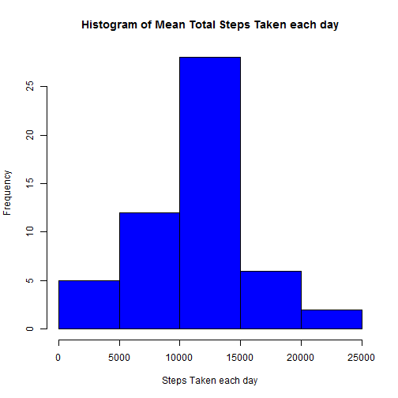

Reproducible Research - Peer Assessment 1
=========================================
Date: 14-Dec-2014
Author: Ling Kok Heng

For description of the Peer Assessment 1, please see:  
https://class.coursera.org/repdata-016/human_grading/view/courses/973760/assessments/3/submissions

Loading and preprocessing the data
----------------------------------
This report requires `activity.csv` to be located in the same folder (working directory) as `PA1_template.Rmd`. You need to unzip the original datasets from: https://d396qusza40orc.cloudfront.net/repdata%2Fdata%2Factivity.zip and copy the `activity.csv` to your working directory.

### 1. Loading the data

```r
activity.raw <- read.csv("activity.csv")
```

### 2. Preprocessing the data

```r
activity.raw$date <- as.Date(activity.raw$date , format = "%Y-%m-%d") # convert to date type

# Aggregate number of steps per day to a temp dataset
activity.steps.day <- aggregate(activity.raw$steps, by=list(activity.raw$date), sum)
colnames(activity.steps.day) = c("day","steps")

# Aggregate number of steps per interval to a temp dataset
activity.steps.interval <- aggregate(activity.raw$steps, by=list(activity.raw$interval), sum, na.rm=TRUE, na.action=NULL)
colnames(activity.steps.interval) = c("interval","steps")

# Aggregate mean steps per interval to a temp dataset
activity.means.interval <- aggregate(activity.raw$steps, by=list(activity.raw$interval), mean, na.rm=TRUE, na.action=NULL)
colnames(activity.means.interval) = c("interval","means.steps")
```

What is the mean total number of steps taken per day?
-------------------------------------------------

### 1. Histogram of the mean total number of steps taken each day

```r
hist(activity.steps.day$steps, 
     main = "Histogram of Mean Total Steps Taken each day",
     xlab = "Steps Taken each day",
     col = "blue")
```

 

### 2. Calculate the mean and median total number of steps taken per day

__Mean number of steps per day:__  __10766.19__ 

```r
mean(activity.steps.day$steps, na.rm = TRUE)
```

```
## [1] 10766.19
```

__Median number of steps per day:__  __10765__

```r
median(activity.steps.day$steps, na.rm = TRUE)
```

```
## [1] 10765
```

What is the average daily activity pattern?
------------------------------------------
### 1. Average Steps by Time Interval -- Using Time series plot
_To make a time series plot (i.e. type = "l") of the 5-minute interval (x-axis) and the average number of steps taken, averaged across all days (y-axis)_

```r
plot(activity.means.interval$interval, activity.means.interval$means.steps, type="n", 
     main="Average Steps by Time Interval",
     xlab = "Time Intervals (5-minute) ",
     ylab = "Average number of steps")
lines(activity.means.interval$interval, activity.means.interval$means.steps,type="l",col="red") 
```

 

### 2. The 5-min interval that contains the maximum number of steps
_determine Which 5-minute interval, on average across all the days in the dataset, contains the maximum number of steps?_      

__The 5-minute interval with maximum number of steps is:__  __835__ __and the maximum number of steps =__  __206.17__

```r
activity.means.interval[which.max(activity.means.interval$means.steps),1]
```

```
## [1] 835
```

Inputing missing values
---------------------------
### 1. Calculate total number of missing values
_Calculate and report the total number of missing values in the dataset (i.e. the total number of rows with NAs)_     

__Total number of missing values in the dataset is:__  __2304__


```r
sum(is.na(activity.raw$steps))
```

```
## [1] 2304
```

### 2. Strategy for Patching missing values
_Devise a strategy for filling in all of the missing values in the dataset. The strategy does not need to be sophisticated. For example, you could use the mean/median for that day, or the mean for that 5-minute interval, etc._   

__Since the `activity.means.interval` dataset (contains mean per interval) has been created during the preprocessing step above, the strategy is to use the means for the interval as a replacement for 'NA' values.__

```r
# merging both activity.raw and activity.means.interval datasets
value.missing <- merge(activity.raw, activity.means.interval, by = "interval", sort= FALSE) 

# sort on date and interval
value.missing <- value.missing[with(value.missing, order(date,interval)), ] 

# replace "NA" in steps column with value in means.steps column
value.missing$steps[is.na(value.missing$steps)] <- value.missing$means.steps[is.na(value.missing$steps)] 
```
Note: the dataset now contains fractions for the number of steps:

```r
head(value.missing)
```

```
##     interval     steps       date means.steps
## 1          0 1.7169811 2012-10-01   1.7169811
## 63         5 0.3396226 2012-10-01   0.3396226
## 128       10 0.1320755 2012-10-01   0.1320755
## 205       15 0.1509434 2012-10-01   0.1509434
## 264       20 0.0754717 2012-10-01   0.0754717
## 327       25 2.0943396 2012-10-01   2.0943396
```
It would make sense to round the steps into a whole number instead of fraction after ptaching:

```r
value.missing$steps <- round(value.missing$steps, digits = 0)
head(value.missing)
```

```
##     interval steps       date means.steps
## 1          0     2 2012-10-01   1.7169811
## 63         5     0 2012-10-01   0.3396226
## 128       10     0 2012-10-01   0.1320755
## 205       15     0 2012-10-01   0.1509434
## 264       20     0 2012-10-01   0.0754717
## 327       25     2 2012-10-01   2.0943396
```

### 3. New dataset with missing data patched
_Create a new dataset that is equal to the original dataset but with the missing data filled in._

```r
activity.value.new <- value.missing[, c(2,3,1)]
```

### 4.a. Histogram of total number of steps for (3)
_-Make a histogram of the total number of steps taken each day._   
_-Calculate and report the mean and median total number of steps taken per day._    
_-Do these values differ from the estimates from the first part of the assignment?_   
_-What is the impact of imputing missing data on the estimates of the total daily number of steps?_   


```r
# create a new dataset with patched data (NA replaced with mean steps per interval) on total steps per day
activity.data.new <- aggregate(activity.value.new$steps, by=list(activity.value.new$date), sum)
colnames(activity.data.new)= c("day","steps")

hist(activity.data.new$steps, 
     main = "Distribution of the Total Steps Taken per day (NA replaced)",
     xlab = "Total Steps Taken per day",
      col = "green")
```

 

### 4.b. The mean and median total number of steps taken per day

__Mean number of steps per day (with 'NAs' patched):__  __10765.64__ 

```r
mean(activity.data.new$steps)
```

```
## [1] 10765.64
```
__Median number of steps per day (with 'NAs' patched):__ __10762__

```r
median(activity.data.new$steps)
```

```
## [1] 10762
```
### 4.c. Do these values differ from the estimates from the first part of the assignment

__With 'NAs' patched, both the new Mean (10765.64) and new Median (10762) are slightly lower when compared to the Mean (10766.19) and Median (10765) in the first part of the assignment with 'NAs' in the datasets.__

### 4.d.  The impact of inputing missing data on the estimates of the total daily number of steps

__The new histogram shows a similar distribution but with overall higher frequencies due to the 'NAs' being substituted with the means value.__ 

See also this side by side plot for quick comparison:


```r
par(mfrow=c(1,2))

hist(activity.steps.day$steps, 
     main = "with 'NA' values",
     xlab = "Total number of steps taken each day",
     col= "blue")

hist(activity.data.new$steps, 
     main = "with 'NA' values substituted",
     xlab = "Total number of steps taken each day",
     col = "green")
```

 

Are there differences in activity patterns between weekdays and weekends?
-------------------------------------------------------------------------
### 1. new factor variable with 2 levels
_Create a new factor variable in the dataset with two levels "weekdays" and "weekends" indicating whether a given date is a weekday or weekend day._


```r
# create copy of the patched dataset
activity.data.newcopy <- activity.value.new
# use English date names
Sys.setlocale("LC_TIME", "English")
```

```
## [1] "English_United States.1252"
```

```r
# create a factor with the names of the days for all dates
activity.data.newcopy$weekdays <- factor(format(activity.data.newcopy$date,"%A"))
# the day names 
levels(activity.data.newcopy$weekdays)
```

```
## [1] "Friday"    "Monday"    "Saturday"  "Sunday"    "Thursday"  "Tuesday"  
## [7] "Wednesday"
```

```r
# replace the levels
levels(activity.data.newcopy$weekdays) <- list("weekday" = c("Monday", "Tuesday", "Wednesday", "Thursday", "Friday"), "weekend" = c("Saturday", "Sunday"))
levels(activity.data.newcopy$weekdays)
```

```
## [1] "weekday" "weekend"
```

### 2. Panel plot using time series
_Make a panel plot containing a time series plot (i.e. type = "l") of the 5-minute interval (x-axis) and the average number of steps taken, averaged across all weekday days or weekend days (y-axis)._

```r
activity.mean.step.day <- aggregate(activity.data.newcopy$steps, by=list(activity.data.newcopy$weekdays, activity.data.newcopy$interval), mean, na.rm=TRUE, na.action=NULL)
colnames(activity.mean.step.day)= c("weekday","interval","mean.steps")

library(lattice) 
xyplot(activity.mean.step.day$mean.steps ~ activity.mean.step.day$interval | activity.mean.step.day$weekday, 
       layout=c(2,1), 
       type="l",
       xlab = "5-minute Interval",
       ylab = "Average number of steps taken")
```

 

__In comparison, there were more activities during the weekend plots than the weekday plots.  Though there were high spikes during the weekday, this could be due to data outliers. The weekend plots seemed to have a more consistent higher average number of steps.__  

Thanks for taking your precious time in reviewing my assignment.   
### End of Assignment.  
